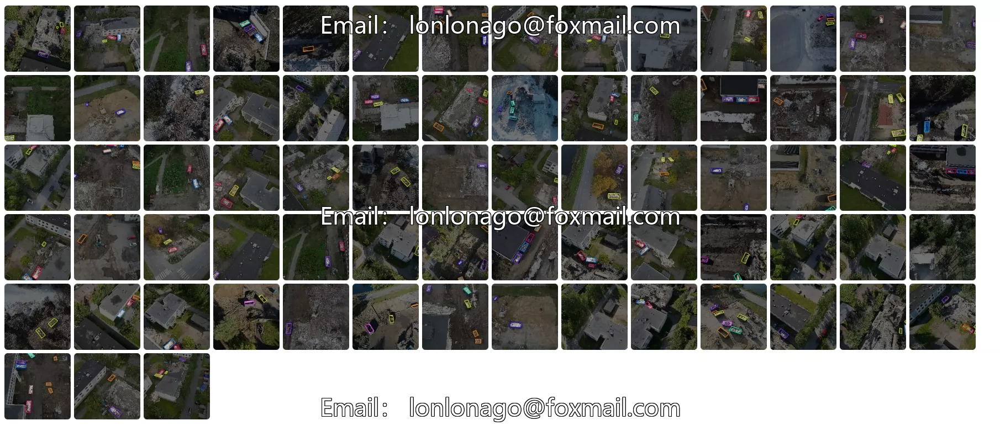
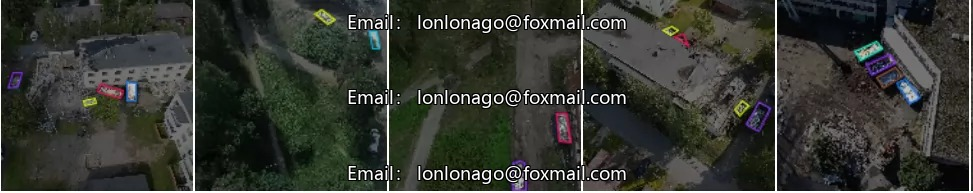
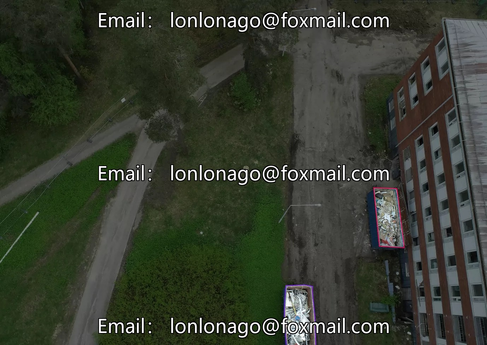
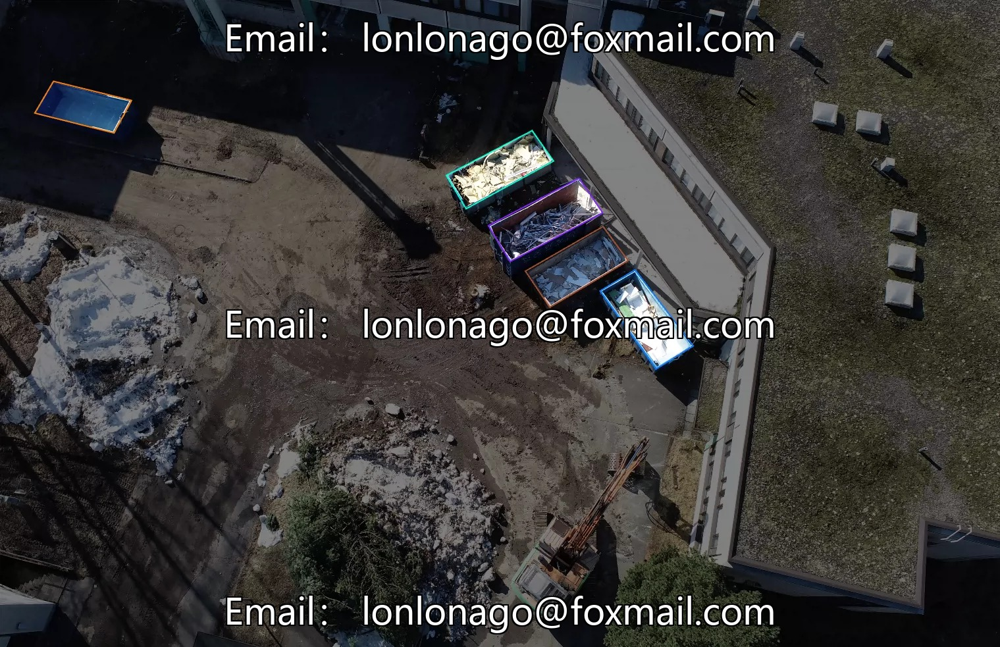

## Body

Drone high altitude, building waste target recognition, YOLO format, a total of 3382 images, labeled separately, divided into training set, test set, validation set without data enhancement, divided into 12 categories, namely 'cover', 'electronic-waste', 'empty', 'gravel', 'insulator-wool', 'metal', 'mixed-waste', 'plasterboard', 'polystyrene', 'roofing-felt', 'wood', 'wood-panel' "Cover", "Electronic waste", "Empty", "Gravel", "Insulator wool", "Metal", "Mixed waste", "Plasterboard", "Polystyrene", "Roofing felt", "Wood", "Wood panel" The sale of electronic virtual products is not refundable.

## Images

item_1027733205791

Here is a pay link on Stripe ( https://buy.stripe.com/3cs8yP7sY87d0vu9AB ). Please contact me lonlonago@foxmail.com after funding $89, and I will send you a complete data files , thank you!

